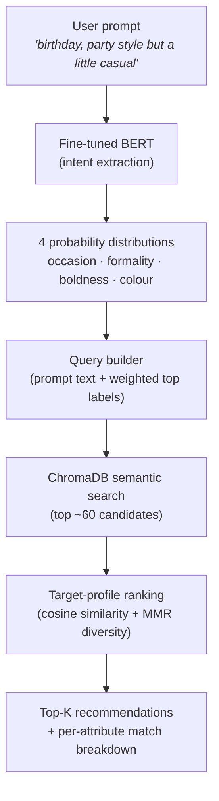

# AI-Powered Fashion Recommender

A Streamlit app that turns a free-text style prompt — *"final round interview, polished and understated"* — into ranked outfit recommendations from a real product catalog. It combines a fine-tuned BERT intent model, semantic retrieval over a vector database, and a custom target-profile ranking algorithm.

## Overview

Type what you're dressing for and how you want to look. The app:

1. **Reads intent** across four style axes — *occasion, formality, boldness, colour tone* — as a probability distribution, not a single label, so "party but a little casual" is understood as a blend rather than forced into one bucket.
2. **Retrieves** a pool of candidate products by semantic search over a 262-item tagged catalog.
3. **Ranks** them by how closely each product's own attribute profile matches the requested blend (cosine similarity), not by which product scores highest on any single axis.
4. **Explains** every recommendation with a per-attribute match breakdown.

## How it works



### 1. Intent extraction — `streamlit_app.py`, `recommender_core.py`
A BERT-base encoder with four independent classification heads predicts a softmax distribution over each axis:

| Axis | Classes |
|---|---|
| Occasion | casual · date · office · party · vacation · wedding |
| Formality | casual · semi-formal · formal |
| Constraint (boldness) | bold · no-constraint · understated |
| Colour tone | bright · dark · neutral · soft |

The logits are divided by a **temperature** (default `2.0`) before softmax, so a secondary intent ("…but a little casual") stays visible instead of being crushed by an over-confident model.

### 2. Retrieval — ChromaDB
The intent distribution is turned into a query string (your own words plus the top-weighted labels per axis) and embedded via ChromaDB's default sentence embedder to pull a wide candidate pool (~60 products) from the persisted vector store.

### 3. Ranking — the target-profile algorithm (`recommender_core.py`)
This is the core design decision of the project:

- Each product's tagged attribute scores are normalized into a distribution over the same label set as the intent.
- Products are ranked by **cosine similarity between the intent distribution and the product's distribution**, blended with a small raw-confidence term (`alpha`, default `0.8`).
- An optional **MMR (Maximal Marginal Relevance)** pass re-ranks the top results for diversity so recommendations aren't near-duplicates.

The practical effect: a product that is *100% "party"* now scores **lower** than one that is *70% party / 30% casual* when that's the blend the user asked for — the opposite of naive highest-score-wins ranking.

### 4. The catalog — how products are tagged
Each product needs a score against every label above (e.g. "how much does this look like a *party outfit*?"). This was tuned through several iterations (see [Build history](#build-history)) and the current approach (`tag_catalog_rules.py`) is fully deterministic:

- **Garment type** is read from a code embedded in every product image URL (`BLZ` blazer, `JNS` jeans, `DRS` dress, `TRS` trousers, …) and anchors the occasion/formality distribution.
- **Colour** and **style keywords** in the title (solid / sequined / floral / cutout / …) refine boldness and colour tone.
- Output is written to `tagged_catalog.csv` and embedded into the `chromadb_store/` vector database the app reads from.

## Project structure

```
streamlit_app.py         The deployed app — UI, intent extraction, orchestration
recommender_core.py      Shared ranking/retrieval logic (target-profile matching, MMR)
recommender.py           Standalone CLI harness for testing recommendations without Streamlit
tag_catalog_rules.py     Tags the catalog (garment-code + keyword rules) and builds chromadb_store/
build_dataset.py         Builds the BERT training set (adds the `vacation` class + soft/blended labels)
train.py                 Trains the intent model (KL-divergence loss against soft label distributions)
bert.ipynb               Training notebook (mirrors train.py)
label_maps_v2.json       Intent label schema
products_combined.csv    Raw scraped catalog (title, price, image URL)
tagged_catalog.csv       Catalog with computed attribute scores (output of tag_catalog_rules.py)
fashion-bert/            Trained model weights + tokenizer (Git LFS)
chromadb_store/          Persisted vector database the app queries (Git LFS)
product_images/          Product photos
requirements.txt, runtime.txt, .streamlit/config.toml   Deployment config
DEPLOYMENT.md            Streamlit Community Cloud deployment notes
```

## Getting started

```bash
python -m venv .venv && source .venv/bin/activate   # or use the existing .venv/
pip install -r requirements.txt
streamlit run streamlit_app.py
```

The app needs `fashion-bert/model.pt` and `chromadb_store/` present locally (both are Git LFS-tracked — run `git lfs pull` after cloning if they arrive as pointer files).

To try the recommendation logic without the UI:
```bash
python recommender.py
```

## Model & data

- **Intent model**: BERT-base + 4 linear heads, trained with KL-divergence against soft-label targets (`train.py`). Evaluated each epoch against a frozen, hand-written held-out set (`fashion_data_v2_heldout.csv`, 132 prompts never used for training) — `train.py` prints per-axis weighted F1 and held-out KL-divergence during training.
- **Training data**: 1,066 labelled prompts (`build_dataset.py`), including hand-written blended examples ("office party, mostly work appropriate but slightly festive" → 60% office / 40% party) so the model learns graded intent, not just single-label classification.
- **Catalog**: 296 scraped products → 262 after removing accessories/duplicates, each tagged on all 4 axes.

## Deployment

Deployed on Streamlit Community Cloud. See [DEPLOYMENT.md](DEPLOYMENT.md) for the full runbook, including hosting the model weights on Hugging Face to avoid Git LFS bandwidth limits on rebuilds.

## Build history

1. **Baseline app** — BERT intent extraction (argmax labels) → ChromaDB keyword query → weighted-sum scoring against CLIP-tagged products.
2. **Deployment hardening** — pinned dependencies, CPU-only PyTorch, config-based model loading (no redundant pretrained-weight download), cached DB client, Streamlit Cloud setup.
3. **Target-profile ranking** — replaced argmax + highest-score-wins with softmax temperature, distribution-based intent, and cosine target-matching + MMR diversity, so blended prompts produce blended, varied results instead of one repeated bucket.
4. **Retrain with soft labels** — expanded the label schema (added `vacation`), built a dataset with explicit blended/soft-label examples, retrained the intent model with KL-divergence loss.
5. **Catalog re-tagging** — diagnosed and fixed a product/image off-by-one bug in the original scrape; evaluated CLIP and FashionCLIP zero-shot tagging (both proved unreliable — FashionCLIP alone mistagged ~35% of the catalog as "office wear"); settled on a deterministic garment-code + keyword tagger, which is faster, reproducible, and more accurate for this catalog.

## Known limitations

- The catalog (262 items, fast-fashion/casual-skewed) caps how well niche prompts (e.g. formal-wear-heavy requests) can be served — the ranking is only as good as the available inventory.
- Attribute tagging is rule-based rather than visually verified per item; it's deterministic and inspectable, but not a substitute for human curation at scale.
- The `constraint` and `color_tone` axes are inherently more subjective than `occasion`/`formality` and score lower on held-out evaluation.
